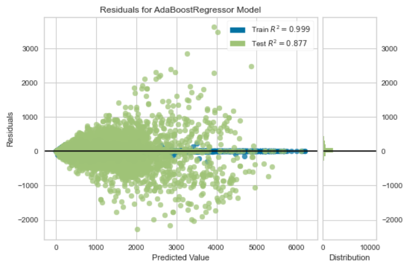
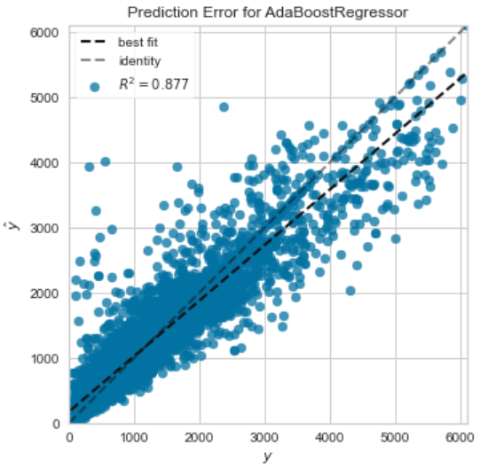

## Objective

>  The objective is to predict the registered scooter from the rental data
>  using Regression model.

## Dataset
>  The dataset used, the source, the targets and the features
>-  Rental dataset
>-  target is registered scooter
>-  main features used are hr, feels_like_temperature, guest_scooter

>
|                        |                                                         |
|------------------------|---------------------------------------------------------|
| hr                     | Hour (0 to 23)                                          |
| feels_like_temperature | Average feeling temperature for that hour (Fahrenheit)  |
| guest_scooter          | No. of guest users using rental e-scooters in that hour |

## Setting up Environment in PyCaret
> The setup() function initializes the environment in pycaret and creates the transformation pipeline to prepare the data for modeling and deployment.  
> It takes two mandatory parameters: a pandas dataframe and the name of the target column.  
> PyCaret displays a table containing the features and their inferred data types after setup() is executed.

## Comparing All Models
>Comparing all models to evaluate performance is the recommended starting point for modeling once the setup is completed.  
>This function trains all models in the model library and scores them using kfold cross validation for metric evaluation.

## Create a Model
> This function creates a model and scores it using stratified cross validation.  
> The output prints a score grid that shows MAE, MSE, RMSE, R2, RMSLE and MAPE by fold.

> Extra Trees Regressor is used as it has the best result in compare models.

## Plot a Model

## Predict on test
>All of the evaluation metrics we have seen above are cross validated results based on training set (70%) only.  

>
| Model               | MAE    | MSE    | RMSE   | R2     | RMSLE  | MAPE
|---------------------|--------|--------|--------|--------|--------|------
| Ada Boost Regressor | 216.31 | 136135 | 368.96 | 0.8766 | 0.4488 |0.431

## Finalize Model for Deployment
>The purpose of this function is to train the model on the complete dataset before it is deployed in production.

## Predict on unseen data
>The predict_model() function is also used to predict on the unseen dataset.  
>The Label column is added onto the data_unseen set. Label is the predicted value using the final ExtraTrees model.

## Saving the model
>This function allows us to save the model along with entire transformation pipeline for later use.
